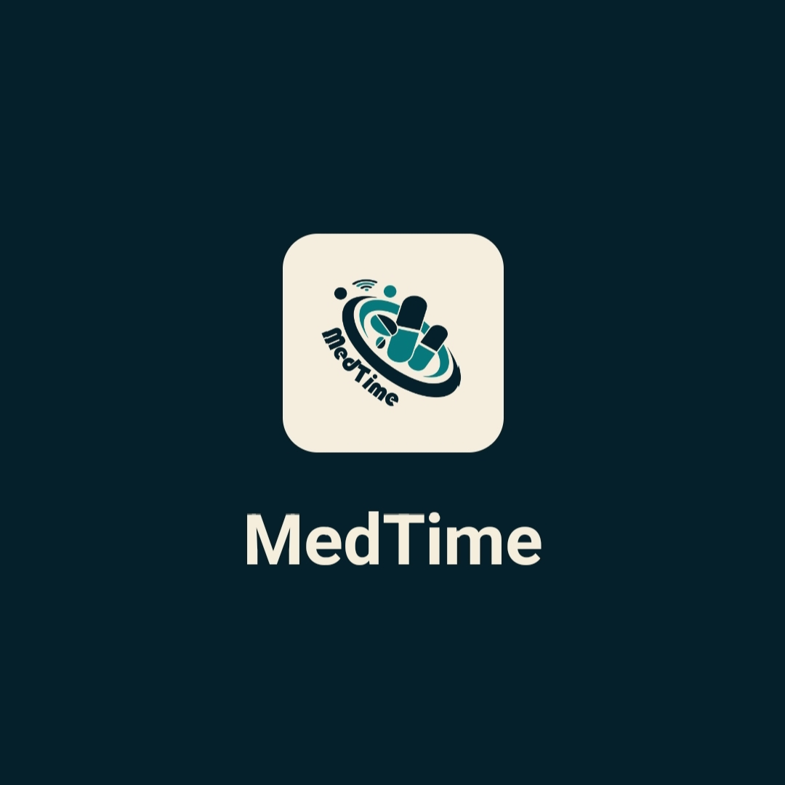
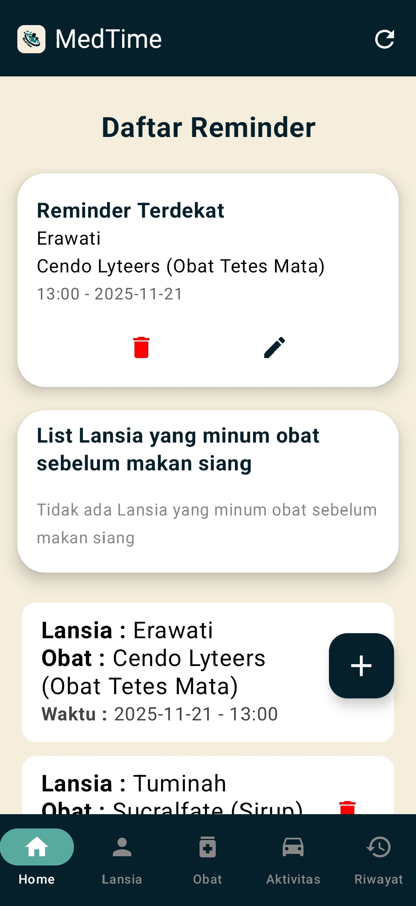
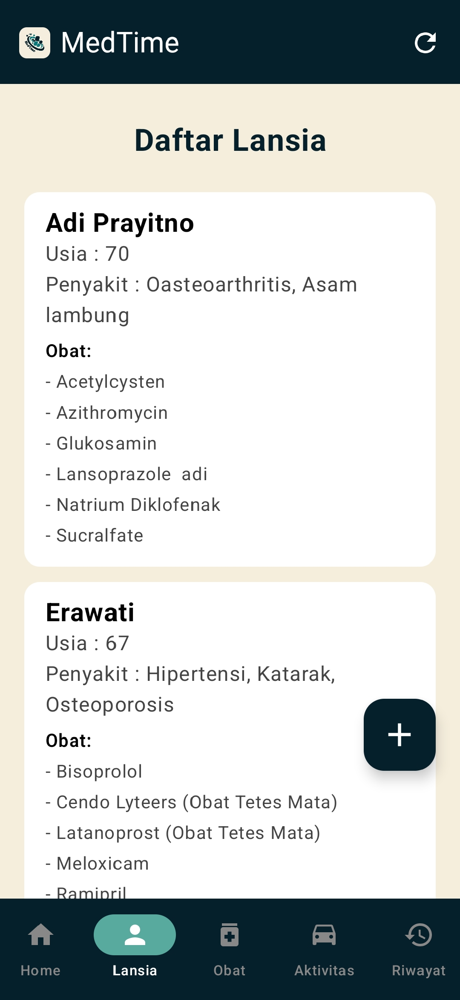
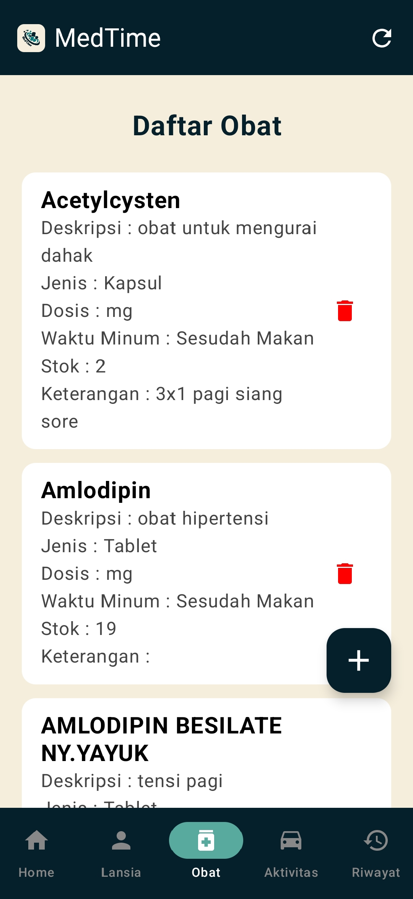
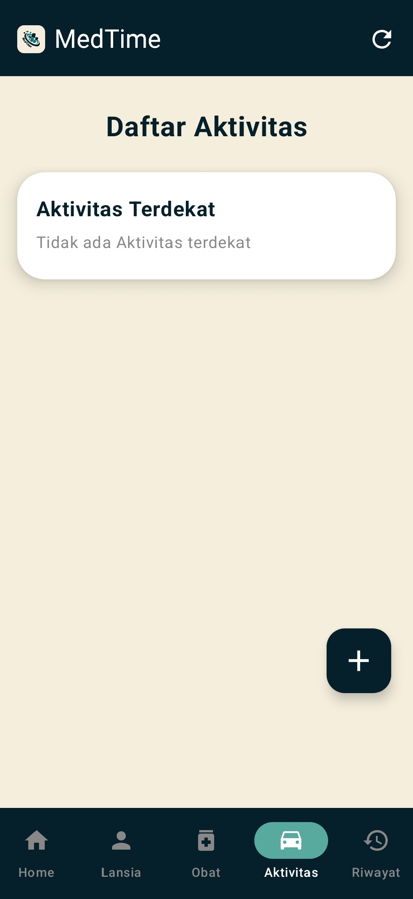
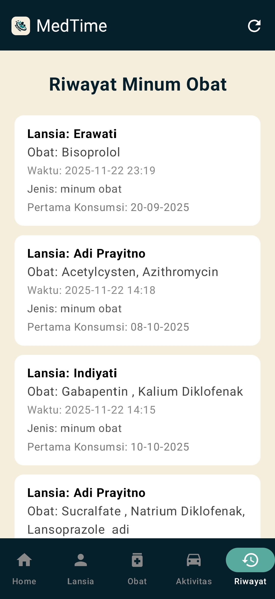

# **MedTime Mobile Application**  
`Smart Medication Reminder with IoT Device Integration`

## 📌 Overview  
MedTime Mobile Application is a mobile-based medication reminder system designed to help users manage their daily medication schedules effectively. The app provides timely notifications and integrates with **MedTime IoT Device** to deliver both digital and physical alerts.

With a focus on usability and accessibility, this application is especially beneficial for elderly users and caregivers who require reliable and consistent medication reminders.

## 👥 Team Members  
- `71220821 - Stefani Hartanto`  
- `71220869 - Nicholas Dwinata`  
- `71220885 - Angela Sekar Widelia`  
- `71230986 - Ivan Roberto Halim`  

## ⚙️ Features  
- ⏰ Scheduled medication reminders  
- 🔔 Alarm-based notification system  
- 📱 User-friendly interface for managing medicine schedules  
- 🔄 Automatic rescheduling after device reboot  
- 📡 Integration with IoT device for audio alerts  
- 📶 Network-aware system (detects connectivity changes)  

## 🧩 Core Modules  
- `Alarm System` → Handles reminder scheduling and triggering  
- `Database (Room)` → Stores medication data locally  
- `Network Utils` → Monitors connectivity status  
- `Broadcast Receiver` → Handles alarms and boot events  
- `UI Layer` → User interaction and navigation  

## 🛠️ Tech Stack  
- 💻 Mobile Development: `Kotlin (Android)`  
- 🗄️ Local Database: `Room (SQLite)`  
- 🔥 Backend Integration: `Firebase`  
- 📡 IoT Communication: `MQTT / API Integration`  

## 🧠 How It Works  
1. User inputs medication schedule through the app  
2. Data is stored locally using Room Database (SQLite-based) to support offline usage  
3. When an internet connection is available:  
   - Data is synchronized to Firebase  
   - Local records are marked as synced (`isSynced = true`)  
4. AlarmManager schedules reminders based on the stored data  
5. When triggered:  
   - Notification and alarm sound are activated  
   - IoT device is notified for external audio alert  
6. If the device restarts:  
   - BootReceiver automatically restores all schedules  

## 📸 Project Showcase  

  
  
  
  
  

- Medication Reminder List  
- Elderly Management List  
- Medicine List  
- Activity List  
- History Log  

## 📄 Notes  
This MedTime Mobile Application were developed as part of our participation in the `Program Kreativitas Mahasiswa – Pengabdian Masyarakat (PKM-PM)` organized by the Ministry of Education, Culture, Research, and Technology of Indonesia (Kemendikbudristek).
